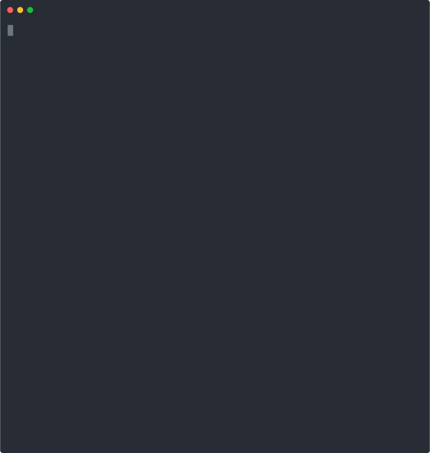

# The Committer

<a href="https://github.com/mrshennawy/committer/actions"></a>
<a href="https://packagist.org/packages/mrshennawy/committer"></a>
<a href="https://packagist.org/packages/mrshennawy/committer"></a>
<a href="https://packagist.org/packages/mrshennawy/committer"></a>

<p align="center">
  
</p>
**committer** is a Composer package that simplifies the process of writing standard Git commit messages. It helps developers maintain a consistent and clean commit history.

## Table of Contents

1. [Installation](#installation)
2. [Usage](#usage)
3. [Authors](#authors)
4. [License](#license)
  
## Installation

Committer uses [Composer](https://getcomposer.org/) to manage its dependencies. Make sure you have Composer installed on your machine before using Committer.
You must place Composer's system-wide vendor bin directory in your `$PATH` so that your system can locate the Committer executable.
This directory exists in different locations based on your operating system. Some common locations include:

- macOS: `$HOME/.composer/vendor/bin`
  - ```bash
    export PATH=$PATH:$HOME/.composer/vendor/bin
- Windows: `%USERPROFILE%\AppData\Roaming\Composer\vendor\bin`
  - ```bash
    set PATH=%PATH%;%USERPROFILE%\AppData\Roaming\Composer\vendor\bin
- GNU / Linux Distributions: `$HOME/.config/composer/vendor/bin` or `$HOME/.composer/vendor/bin`
  - ```bash
    export PATH=$PATH:$HOME/.config/composer/vendor/bin
  or
  - ```bash
    export PATH=$PATH:$HOME/.composer/vendor/bin`

You can also find the global installation path of Composer by running `composer global about` and looking for it in the first line. 

## Usage

After installing the package, you can use it by running only `gc`:
- The `gc` command now supports the following options:
  - `--select`: This option allows to select the files before committing. It can be used as `gc --select` or `gc -s`.
  - `--build`: This option builds the project before commit. It can be used as `gc --build` or `gc -b`.

## Authors

- Mahmoud Shennawy  | [GitHub](https://github.com/MrShennawy)  | [LinkedIn](https://www.linkedin.com/in/mrshennawy) | <m.alshenaawy@gmail.com>

You can also see the list of [contributors](https://github.com/mrshennawy/committer/contributors) who participated in this project.

## License

This project is licensed under the MIT License. See the file [LICENSE.md](LICENSE.md) for details.